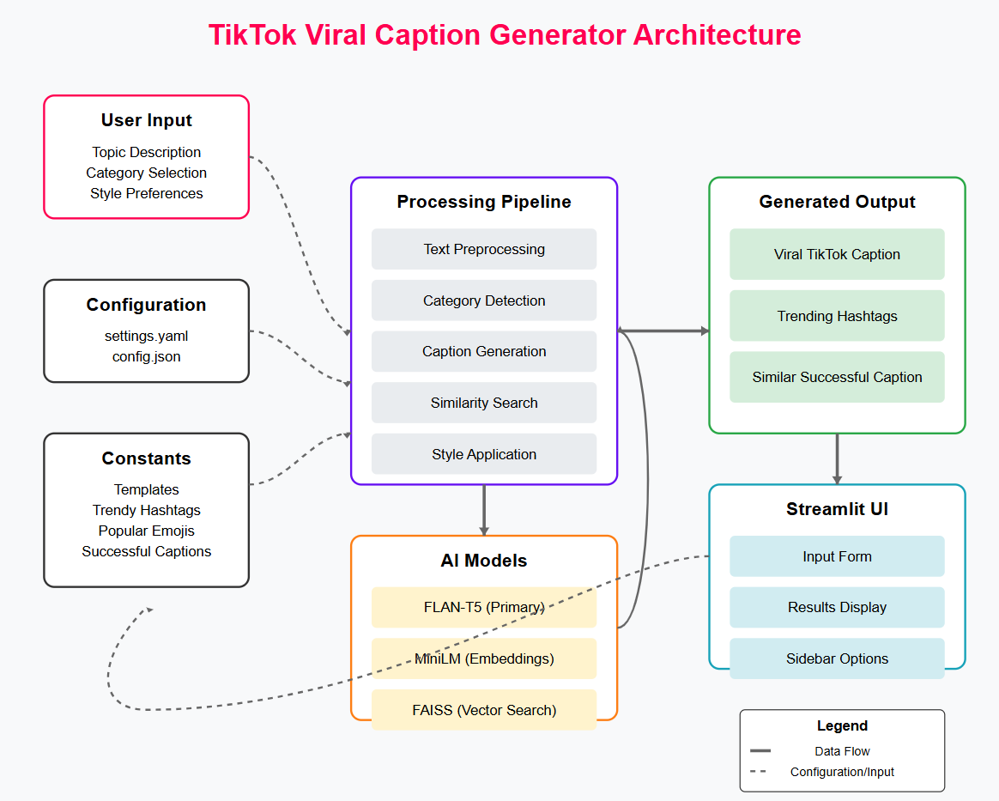

# Let's Build a Viral TikTok Caption Generator


## TL;DR
I built an AI-powered onboarding assistant that guides new employees through their first days using natural language processing. The system answers HR questions using company documents, displays personalized schedules and checklists, and generates welcome emails — all through a simple command-line interface. By separating business logic from technical implementation, it’s easily adaptable to different organizations.

## Introduction:
First day at job is overwhelming — paperwork everywhere, countless new systems to learn, and a calendar packed with orientation meetings. I remember thinking there had to be a better way. That’s when the idea struck me: what if we could build an intelligent assistant that guided employees through their first days while answering their questions instantly? No more hunting through outdated wikis or waiting for HR to respond to emails. This article walks through how I built exactly that — an AI-powered onboarding agent that makes the first week at a new job smoother for everyone involved.

## What’s This Article About?
This article explores the development of an AI onboarding system that serves as a virtual assistant for new employees. The system I built combines several powerful technologies into a practical tool that:

- Answers employee questions by retrieving information from company documents using AI
-Displays personalized onboarding checklists showing progress through required tasks
- Provides custom schedules for training and orientation activities
- Shows role-specific learning resources tailored to each employee’s position
- Generates personalized welcome emails with relevant information

The core of the system is a retrieval-augmented generation (RAG) pipeline that finds relevant information in company documents and uses a large language model to craft helpful responses. I designed it with a simple command-line interface where employees can type natural commands like “ask what is the vacation policy?” or “show my schedule” to get immediate assistance.

What makes this system special is how it separates technical implementation from business content. HR teams can easily update onboarding schedules, checklists, and company information without touching any code, while the technical foundation remains stable and maintainable.

Full Article : [https://medium.com/@learn-simplified/how-i-built-agentic-employee-onboarding-system-d830ac92293d


## Tech Stack  


## Architecture




# Tutorial: Let's Build a Viral TikTok Caption Generator

## Prerequisites
- Python installed on your system.
- A basic understanding of virtual environments and command-line tools.

## Steps

1. **Virtual Environment Setup:**
   - Create a dedicated virtual environment for our project:
   
     ```bash
     python -m venv Lets-Build-a-Viral-TikTok-Caption-Generator
     ```
   - Activate the environment:
   
     - Windows:
       ```bash
          Lets-Build-a-Viral-TikTok-Caption-Generator\Scripts\activate        
       ```
     - Unix/macOS:
       ```bash
       source Lets-Build-a-Viral-TikTok-Caption-Generator/bin/activate
       ```
   

# Installation and Setup Guide

**Install Project Dependencies:**

Follow these steps to set up and run the  "Let's Build a Viral TikTok Caption Generator"

1. Navigate to your project directory:
   ```
   cd path/to/your/project
   ```
   This ensures you're in the correct location for the subsequent steps.

2. Install the required dependencies:
   ```
   pip install -r requirements.txt   
   ```
   This command installs all the necessary Python packages listed in the requirements.txt file.


# Run - Hands-On Guide: Let's Build a Viral TikTok Caption Generator
  
   ```

   streamlit run app.py
   
   ```
   
## Closing Thoughts

The future of AI in business isn’t about replacing humans but augmenting them with tools that handle routine tasks while providing insights that would otherwise remain hidden. As large language models become more capable and specialized domain knowledge becomes easier to integrate, we’ll see AI assistants becoming integral to every business function.

Within the next few years, I expect onboarding systems like this one to evolve from text-based interfaces to multimodal experiences that include voice interaction, augmented reality walkthroughs of office spaces, and adaptive learning paths that adjust based on each employee’s progress and learning style.

The most exciting developments will come from the data these systems collect. By analyzing patterns in questions asked, resources accessed, and time spent on different onboarding activities, companies will gain unprecedented insights into how to streamline the employee experience from day one.

The businesses that thrive in the coming decade won’t be those that simply adopt AI tools, but those that thoughtfully integrate them into human workflows — creating systems where technology handles the routine while humans focus on creative, strategic, and interpersonal challenges. The onboarding system described in this article represents just one step in that broader journey.
